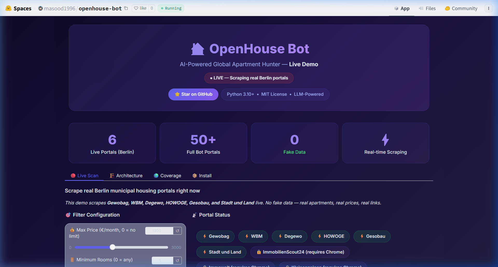
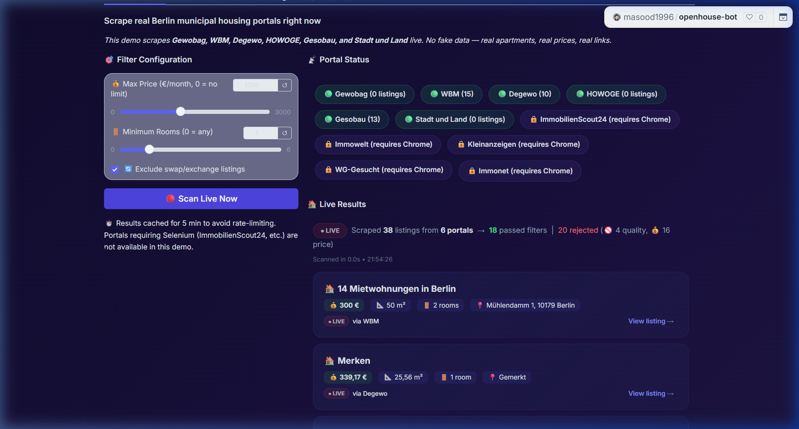
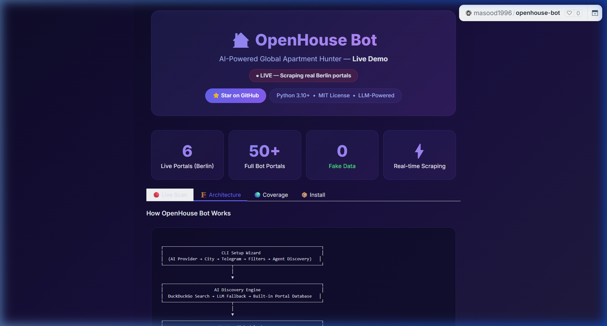

<div align="center">

# 🏠 OpenHouse Bot

### AI-Powered Global Apartment Hunter

**Stop spending hours refreshing listing pages.**
OpenHouse Bot scrapes 50+ real estate portals worldwide, filters results with surgical precision, and delivers matching apartments straight to your Telegram — automatically, 24/7.

[](https://python.org)
[](LICENSE)
[]()
[]()
[](https://huggingface.co/spaces/masood1996/openhouse-bot)

---

```
   ██████╗ ██████╗ ███████╗███╗   ██╗██╗  ██╗ ██████╗ ██╗   ██╗███████╗███████╗
  ██╔═══██╗██╔══██╗██╔════╝████╗  ██║██║  ██║██╔═══██╗██║   ██║██╔════╝██╔════╝
  ██║   ██║██████╔╝█████╗  ██╔██╗ ██║███████║██║   ██║██║   ██║███████╗█████╗
  ██║   ██║██╔═══╝ ██╔══╝  ██║╚██╗██║██╔══██║██║   ██║██║   ██║╚════██║██╔══╝
  ╚██████╔╝██║     ███████╗██║ ╚████║██║  ██║╚██████╔╝╚██████╔╝███████║███████╗
   ╚═════╝ ╚═╝     ╚══════╝╚═╝  ╚═══╝╚═╝  ╚═╝ ╚═════╝  ╚═════╝ ╚══════╝╚══════╝
```

</div>

---

## 🎮 Try it Live

> **No installation needed — [try the live demo on Hugging Face](https://huggingface.co/spaces/masood1996/openhouse-bot)**
>
> The demo scrapes **6 real Berlin municipal housing portals** live. Real apartments, real prices, real links.

<div align="center">
  
</div>

<details>
<summary><strong>📸 Screenshot Gallery (click to expand)</strong></summary>

| Dashboard | Live Scan Results |
|:-:|:-:|
|  |  |

| Architecture |
|:-:|
|  |

</details>

---

## ✨ Features

| Feature | Description |
|---------|-------------|
| 🌍 **Global Coverage** | Works in 40+ cities across 10+ countries — Berlin, London, Amsterdam, Paris, and more |
| 🤖 **AI-Powered Discovery** | Uses DuckDuckGo search + LLM fallback to automatically find apartment portals for any city |
| 🧠 **LLM Universal Crawler** | When no native scraper exists, an AI agent renders the page in a headless browser and extracts listings using zero-shot JSON prompting |
| 🛡️ **Anti-Bot Bypass** | Headless Chrome with `undetected_chromedriver` to bypass AWS WAF, Cloudflare, and reCAPTCHA |
| 📱 **Telegram Notifications** | Real-time push alerts for new listings — title, price, size, rooms, address, and direct URL |
| 🏢 **Agent Discovery** | LLM-powered extraction of rental agent contact info (name, phone, email, hours) — not just links |
| 🔍 **Smart Filtering** | City-locked results, swap/exchange exclusion, price/size/room filters, and a quality gate that rejects garbage |
| ♻️ **Continuous Monitoring** | Loops every 10 minutes with jitter, de-duplicates via SQLite, and auto-retries on failures |
| 🎯 **Interactive Setup Wizard** | Guided CLI onboarding — pick your AI provider, model, city, and notification method in minutes |

---

## 🚀 Quick Start

### Prerequisites

- **Python 3.10+**
- **Google Chrome** (for headless crawling)
- **Telegram Bot Token** ([create one via @BotFather](https://t.me/BotFather))

### Installation

```bash
# Clone the repository
git clone https://github.com/masood1996-geo/openhouse-bot.git
cd openhouse-bot

# Run the installer (Windows)
install.bat

# Or install manually
pip install -e .
```

### Launch

```bash
python -m openhouse.cli
```

The interactive setup wizard will guide you through:

1. **AI Provider** — Choose OpenRouter, OpenAI, or Kilo (free models available)
2. **City** — Any supported city worldwide
3. **Telegram Bot** — Paste your token, send a message, and auto-detect your Chat ID
4. **Filters** — Set price, rooms, swap exclusion preferences

---

## 🏗️ Architecture

```
┌─────────────────────────────────────────────────────────────────┐
│                        CLI Setup Wizard                         │
│  (AI Provider → City → Telegram → Filters → Agent Discovery)   │
└────────────────────────────┬────────────────────────────────────┘
                             │
                             ▼
┌─────────────────────────────────────────────────────────────────┐
│                     AI Discovery Engine                         │
│  DuckDuckGo Search → LLM Fallback → Built-in Portal Database   │
└────────────────────────────┬────────────────────────────────────┘
                             │
                             ▼
┌─────────────────────────────────────────────────────────────────┐
│                       Hunter (Scheduler)                        │
│              Loops every 10 min + random jitter                 │
└────┬───────────┬───────────┬───────────┬───────────┬────────────┘
     ▼           ▼           ▼           ▼           ▼
┌─────────┐┌─────────┐┌─────────┐┌─────────┐┌──────────────────┐
│ImmoScout││Immowelt ││Klein-   ││Gewobag  ││  LLM Universal   │
│  24     ││         ││anzeigen ││WBM/etc  ││    Crawler        │
│(native) ││(native) ││(native) ││(native) ││(AI + headless)   │
└────┬────┘└────┬────┘└────┬────┘└────┬────┘└────────┬─────────┘
     │          │          │          │               │
     └──────────┴──────────┴──────────┴───────────────┘
                             │
                             ▼
┌─────────────────────────────────────────────────────────────────┐
│                    Filter Pipeline                              │
│  Quality Gate → City Lock → Swap Exclusion → Price/Size/Rooms   │
│  → Already Seen (SQLite)                                        │
└────────────────────────────┬────────────────────────────────────┘
                             │
                             ▼
┌─────────────────────────────────────────────────────────────────┐
│                   Notification Engine                           │
│  Telegram (retry + backoff) │ Slack │ Mattermost │ Apprise     │
└─────────────────────────────────────────────────────────────────┘
```

---

## 🌍 Supported Countries & Portals

<details>
<summary><strong>Click to expand full list</strong></summary>

| Country | Portals |
|---------|---------|
| 🇩🇪 Germany | ImmobilienScout24, Immowelt, Kleinanzeigen, WG-Gesucht, Immonet, Gewobag, HOWOGE, WBM, Gesobau, degewo, Stadt und Land |
| 🇳🇱 Netherlands | Pararius, Funda, Kamernet, Huurwoningen |
| 🇬🇧 UK | Rightmove, Zoopla, SpareRoom, OpenRent |
| 🇫🇷 France | SeLoger, Leboncoin, PAP, Logic-Immo |
| 🇪🇸 Spain | Idealista, Fotocasa, Habitaclia, Pisos |
| 🇮🇹 Italy | Immobiliare, Idealista IT, Subito, Casa |
| 🇦🇹 Austria | Willhaben, ImmoScout24 AT, Immonet AT |
| 🇨🇭 Switzerland | Homegate, ImmoScout24 CH, Comparis |
| 🇺🇸 USA | Zillow, Apartments.com, Trulia, Craigslist |
| 🇦🇺 Australia | RealEstate.com.au, Domain, Flatmates |

> **Any city not listed?** The LLM Universal Crawler automatically discovers and parses portals for any city you specify.

</details>

---

## ⚙️ Configuration

The setup wizard creates `.openhouse.yaml` in your project root. You can also edit it manually:

```yaml
# Target URLs (auto-generated by AI Discovery)
urls:
  - https://www.immobilienscout24.de/Suche/de/berlin/berlin/wohnung-mieten
  - https://www.immowelt.de/liste/berlin/wohnungen/mieten
  - https://www.kleinanzeigen.de/s-berlin/wohnung-mieten/c203

# Target city for filtering
target_city: Berlin

# Notification method
notifiers:
  - telegram

telegram:
  bot_token: "YOUR_BOT_TOKEN"
  receiver_ids:
    - 123456789

# Filters
filters:
  max_price: 900
  min_rooms: 2
  exclude_swaps: true

# Background loop
loop:
  active: true
  sleeping_time: 600
  random_jitter: true

# AI Configuration (for LLM Universal Crawler)
ai_provider: openrouter
ai_api_key: "YOUR_API_KEY"
ai_model: "google/gemini-2.5-flash"
```

---

## 🛡️ Filter Pipeline

OpenHouse applies filters in this order to ensure only relevant listings reach you:

1. **🚫 Quality Gate** — Rejects empty titles, corporate pages, press releases, navigation items
2. **🏙️ City Lock** — Only passes listings that mention your target city in address/URL
3. **🔄 Swap Exclusion** — Blocks `Tausch`, `Wohnungstausch`, `swap`, `exchange`, and 10+ variations
4. **💰 Price/Size/Rooms** — Enforces your min/max preferences
5. **📋 Already Seen** — SQLite-backed de-duplication across runs

---

## 🤖 AI Integration

OpenHouse supports multiple AI providers for portal discovery and universal crawling:

| Provider | Setup | Notes |
|----------|-------|-------|
| **OpenRouter** | [Get API Key](https://openrouter.ai) | Free models available (Gemini Flash, etc.) |
| **OpenAI** | [Get API Key](https://platform.openai.com) | GPT-4o-mini recommended |
| **Kilo** | [Get API Key](https://kilo.ai) | Claude Sonnet support |

> **💡 Tip:** For best results with the LLM Universal Crawler, use a model with strong JSON output capabilities. Small/free "thinking" models (< 3B params) may fail to produce valid structured output.

---

## 📋 Changelog

### v1.0.0 — Initial Release
- ✅ Native crawlers for 10+ German & international portals
- ✅ LLM Universal Crawler with headless Chrome rendering
- ✅ AI-powered portal discovery via DuckDuckGo + LLM
- ✅ Interactive CLI setup wizard with live model selection
- ✅ Telegram push notifications with retry & backoff
- ✅ City-locked filtering (no more random cities)
- ✅ Hardened swap/exchange detection (12+ patterns)
- ✅ Quality gate filter for garbage rejection
- ✅ Structured rental agent info blocks
- ✅ Continuous background monitoring with jitter

---

## 🙏 Credits

Built on the shoulders of the [Flathunter](https://github.com/flathunters/flathunter) open-source project, extended with AI capabilities for global apartment hunting.

---

<div align="center">

**Made with ☕ and frustration from apartment hunting in Berlin**

*If this bot helps you find a home, consider starring the repo ⭐*

</div>
